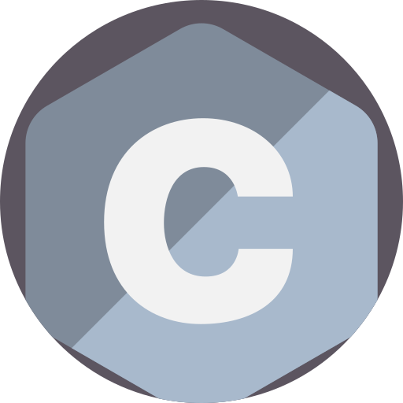
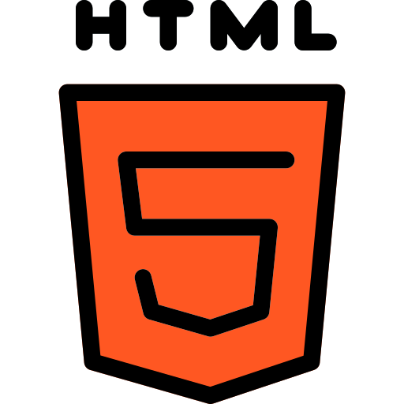
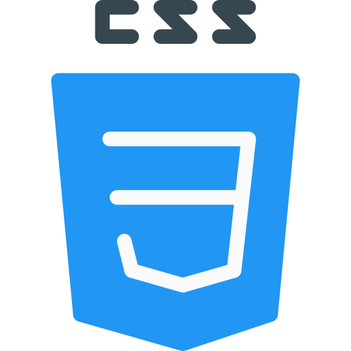
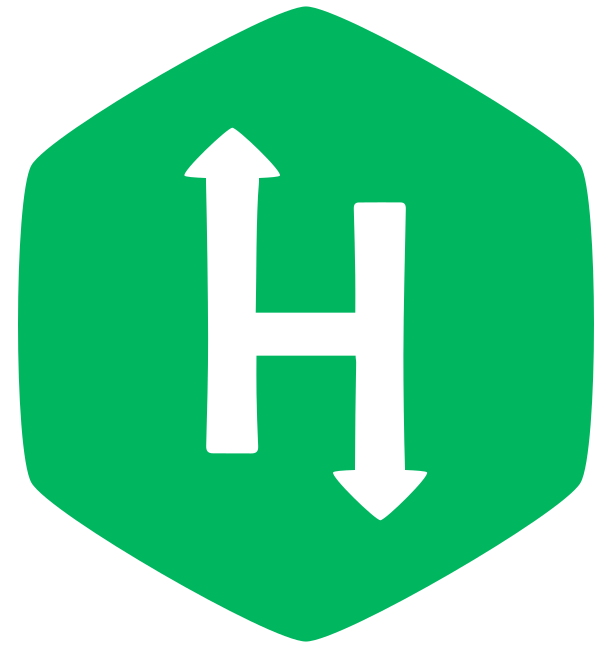

<h1 align="center">𝐇𝐞𝐥𝐥𝐨, 𝐟𝐞𝐥𝐥𝐨𝐰 <𝚌𝚘𝚍𝚎𝚛𝚜/>! 
</h1>

  <em>
    This is ME, Falguni Sarkar, a 2nd year undergraduate from <a href="http://sittechno.org/"> <b>Siliguri Institute of Technology</b>, Siliguri</a>.  
    A budding <b>Full-Stack Developer</b>  and a <b>Competitive Programming Enthusiast</b>&nbsp;&nbsp, who is <b>obsessed</b>
    with the idea of <b>improving</b> herself and wants a <b>platform</b> to 
    <b>grow</b> and 
    <b>excel</b> &nbsp.
  </em> 
  
   

  

<!-- 

     <b><i>Learning while HOPING & HUSTLING!!!</i></b> 
  

 -->

> &nbsp;***Talking about Personal Stuffs:***

- &nbsp;Pronouns: **She/Her**
- &nbsp;I’m currently working on **Competitive Programming**...
- &nbsp;I’m looking to collaborate in **Open - Source Projects**🤝...
- &nbsp;Ask me about anything, I am happy to help, only if the ball is in my court!
- &nbsp;Fun-Fact: I like **sleeping, coding, listening to music, eating and blah blah blah**. I dislike everything except my likes!

<i><b>Languages Currently Learning:</b></i> 
    
  &nbsp;
  &nbsp;
  &nbsp;
  &nbsp;
  &nbsp;
  &nbsp;
  &nbsp;

<i><b>Tools known:</b></i> 
    
  &nbsp;
  &nbsp;
  &nbsp;
  &nbsp;
  &nbsp;
  &nbsp;
  &nbsp;
  &nbsp;

  <i><b>GitHub Stats:</b></i>  
  
  
    
  
    
  
    
  

  <i><b>Profiles:</b></i>  
  
  

<!-- 

  <i><b>Projects I am currently working on:</b></i>  

 
 

 

 -->

 
  <i><b>Currently Playing🎶...</b></i>
    
  

<!-- can't stop myself from editing🤷... -->
